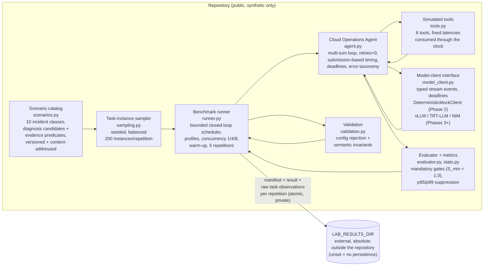

# Architecture

This document describes both the **implemented architecture** (Phases 1–2)
and the intended architecture of later phases. Components marked with a later
phase are built only after that phase is explicitly authorized.

## Overview

```
┌─────────────────────────────────────────────────────────────────────┐
│ Benchmark host (single-GPU cloud instance, one per provider)        │
│                                                                     │
│  ┌────────────────────────┐    ┌─────────────────────────────────┐  │
│  │ Benchmark container    │    │ Serving container               │  │
│  │  - Cloud Ops Agent     │──▶ │  - vLLM | TensorRT-LLM | NIM    │  │
│  │    (Phase 2)           │    │    (Phases 3–4)                 │  │
│  │  - simulated tools     │    │  - Nemotron 3.5 Lightning       │  │
│  │  - scenario driver     │    │    BF16 / NVFP4                 │  │
│  │  - success evaluator   │    └─────────────────────────────────┘  │
│  └────────────┬───────────┘    ┌─────────────────────────────────┐  │
│               │                │ Telemetry (Phase 4)             │  │
│               │                │  - DCGM exporter                │  │
│               │                │  - Prometheus (+ Grafana)       │  │
│               │                │  - selected Nsight Systems      │  │
│               ▼                └─────────────────────────────────┘  │
│  run manifest + results  ────────────▶  $LAB_RESULTS_DIR (PRIVATE,  │
│                                         outside the repository)    │
└─────────────────────────────────────────────────────────────────────┘
```

## Phase 2 — implemented architecture (current)

Phase 2 is implemented in `src/blackwell_lab/workload/` and is **CLI-first
and fully offline**: no browser frontend, web server, persistent dashboard,
authentication system, or hosted service exists or is planned for this phase.
The entry point is the `blackwell-bench` console script
(`python -m blackwell_lab.workload.runner`).

### Logical components and data flow



The runner validates every document — the manifest against
[../schemas/run-manifest.schema.json](../schemas/run-manifest.schema.json),
the result against
[../schemas/benchmark-result.schema.json](../schemas/benchmark-result.schema.json),
and the raw observations against
[../schemas/task-observation.schema.json](../schemas/task-observation.schema.json) —
plus the **semantic invariants** JSON Schema cannot express (exact task
accounting, rate/count agreement, matching run ids, truthful concurrency
bounds, safe relative references) **before** reporting or persisting it, and
persists only through the `LAB_RESULTS_DIR` guard
(`src/blackwell_lab/paths.py`) in explicit synthetic mode: unset means no
persistence anywhere, and no output can fall back into the repository. Every
repetition is persisted promptly when it completes, with atomic
temp-file-plus-rename writes and private permissions; CLI output reports safe
relative filenames and counts only, never absolute private paths.

### One multi-turn task: sequence and measurement boundaries

```mermaid
sequenceDiagram
    participant R as Benchmark runner
    participant A as Agent loop
    participant M as Model client
    participant T as Simulated tools
    participant E as Evaluator

    R->>A: driver submission (a bounded-scheduler slot is claimed;<br/>E2E clock starts HERE; deadline = submission + timeout;<br/>unslotted tasks consume no timeout budget)
    loop each turn (until terminal tool, error, or timeout)
        A->>M: model request with deadline (TTFT + serving clocks)
        M-->>A: typed stream events (content chunks;<br/>token/usage/queue events when the client has them)
        Note over A,M: TTFT = first non-empty content event;<br/>chunks are never tokens
        A->>A: parse + validate tool call (retries=0)
        A->>T: execute simulated tool
        T-->>A: deterministic result (fixed latency<br/>CONSUMED through the clock: it spends<br/>task duration and timeout budget)
    end
    A->>T: recommend_remediation (diagnosis_id,<br/>rationale, remediation_id; the deadline is enforced<br/>after EVERY tool, including this terminal one)
    A->>E: terminal record handed to evaluator immediately
    E-->>R: mandatory gates (diagnosis, remediation,<br/>evidence predicates with typed result constraints)<br/>-> binary success
    R->>R: build manifest + result + raw observations,<br/>validate schemas + semantic invariants
    R-->>R: persist promptly + atomically via<br/>LAB_RESULTS_DIR guard (or no persistence)
```

Measurement boundaries follow the measurement contract §2: end-to-end task
time runs from actual driver submission to the terminal hand-off to the
evaluator; TTFT is the first non-empty content event; ITL exists only with
true per-token timing (transport chunks are never tokens); tool-execution
time uses the fixed, documented simulated latencies — consumed through the
injectable clock so they occupy task duration and timeout budget — and is
separable from model-serving time. Unexpected exceptions are contained as a
sanitized `agent_runtime_error`, so one task never aborts a repetition.

Mock execution is **functional-only**: GPU telemetry, primary latency,
throughput, and SLO attainment are recorded as **unavailable with explicit
reasons** (host-clock replay timings live only in the separated
`mock_diagnostics` namespace) — no measurement is fabricated, and mock Python
replay speed is never reported as model tokens/sec.

### Phase 7 reporting interface (design only)

Structured manifests, result records, configuration versions, hashes, and
reproducible analysis are the authoritative outputs; screenshots are
supplementary only. Because every repetition is a pair of schema-valid JSON
documents, Phase 7 can optionally generate a **static HTML report or
read-only dashboard** from an explicitly approved, sanitized dataset by
consuming those documents — no server, no live service, and no additional
interfaces are required from Phase 2 beyond the stable schemas.

## Components

### Synthetic Cloud Operations Agent (Phase 2 — implemented)

An agent loop that receives deterministic incident scenarios and works them
using simulated tools: `get_service_health()`, `query_metrics()`,
`search_logs()`, `retrieve_runbook()`, `check_recent_changes()`,
`recommend_remediation()`. Tools are backed by synthetic fixture data only —
never production systems or customer information. Tool latency is simulated
deterministically so tool-execution time can be separated from model-serving
time.

### Scenario driver and evaluator (Phase 2 — implemented)

Deterministic incident definitions (elevated latency, pod failures, memory
pressure, GPU saturation, storage latency, failed deployments, unhealthy
upstreams, DNS failures, rate limiting, capacity exhaustion) with
machine-checkable success criteria: published diagnosis candidates, accepted
remediation sets, and evidence predicates with permitted alternative paths
whose result requirements are explicit typed constraints on the tools'
structured response fields (echoed arguments, `available` listings, and
`found: false` responses never satisfy evidence).
Success is gate-based (S_min = 1.0, decision D-0010); component scores are
diagnostics only. Scenarios are deterministic; model outputs are not assumed
to be. Runs use fixed generation settings, record seeds when supported, and
include repeated measurements over seeded, balanced task instances (see
[../methodology/measurement-contract.md](../methodology/measurement-contract.md)).

### Serving stack (Phases 3–4)

One serving container per configuration, pinned by digest. Proposed paths:
vLLM (the openly developed baseline engine), then TensorRT-LLM and NVIDIA
NIM. Precision:
BF16 and NVFP4, subject to the compatibility findings in
[feasibility-report.md](feasibility-report.md).

### Telemetry (Phase 4)

NVIDIA DCGM exporter → Prometheus → Grafana for GPU utilization, memory,
power, and energy. Selected Nsight Systems traces for targeted investigations
only (they are large and not part of routine runs). Telemetry is stored
privately with the run results.

### Results handling (all phases)

- The runner writes genuine results only under `$LAB_RESULTS_DIR`, which must
  resolve **outside** the repository; the runner refuses to start otherwise.
  The guard is implemented in `src/blackwell_lab/paths.py` (Phase 1).
- Every run writes a manifest conforming to
  [../schemas/run-manifest.schema.json](../schemas/run-manifest.schema.json),
  results conforming to
  [../schemas/benchmark-result.schema.json](../schemas/benchmark-result.schema.json),
  and raw per-task observations conforming to
  [../schemas/task-observation.schema.json](../schemas/task-observation.schema.json)
  (warm-up observations labeled and retained separately; summaries are
  derived from the raw observations).
- The repository carries only schemas, synthetic examples, test fixtures,
  methodology, documentation, and code; sanitized results may be added only
  with explicit owner approval (Phase 7).

## Comparison modes

Two strictly separated modes (never mixed in analysis or reporting):

1. **Controlled-resource mode.** The serving and benchmark workload run
   under a documented common CPU and system-memory envelope that is the same
   on all three providers, defined as a **joint total across both containers
   combined** (provisional: 14 vCPUs / 100 GiB joint total, see
   [feasibility-report.md](feasibility-report.md) §7). The exact per-container
   allocation and the cgroup enforcement mechanism are frozen only after
   Phase 3 headroom validation.
2. **Provider-native mode.** Each provider's normal purchasable instance
   configuration, no artificial caps; evaluates what a customer actually
   receives, including economics.

## Host parity notes

The same GPU model across providers creates GPU parity, **not** system parity.
Every run manifest records CPU model and architecture, vCPU count, system
memory, storage type, network configuration, virtualization, driver, CUDA
version, OS, region, and any other material environmental facts, so
differences are recorded rather than hidden.

## Infrastructure-as-code (Phases 3+; deferred, not implemented in Phase 2)

Provider deployment diagrams and infrastructure-as-code are deferred to their
authorized phases: Phase 3 (Akamai Cloud baseline deployment and lifecycle),
Phase 5 (Google Cloud replication), and Phase 6 (AWS replication). Nothing in
Phase 2 provisions, modifies, or tears down any cloud resource.

Provisioning will use Terraform with per-provider modules; state and `.tfvars`
stay outside the repository. `terraform apply`/`destroy` require explicit
owner approval per [../AGENTS.md](../AGENTS.md).

The future infrastructure workflow must support, in order:

1. plan →
2. explicit owner approval →
3. provision →
4. deploy →
5. benchmark →
6. verify external result export (to `LAB_RESULTS_DIR`) →
7. explicit teardown approval →
8. remove **only** resources created for the exact run →
9. verify no project-created billable resources remain.

Billing-safety design constraint: on Akamai, powering off a Linode does not
stop billing — compute billing stops only when the service is deleted from
the account — and on AWS/GCP, disks, addresses, and snapshots may continue
billing while an instance is stopped. Run tooling therefore treats "export
and verify results, then owner-approved deletion of exactly the run's tagged
resources, then verify nothing billable remains" as the normal end-of-session
sequence. Automatic-shutdown, teardown, and orphan-detection controls are
described in [cost-guardrails.md](cost-guardrails.md).
